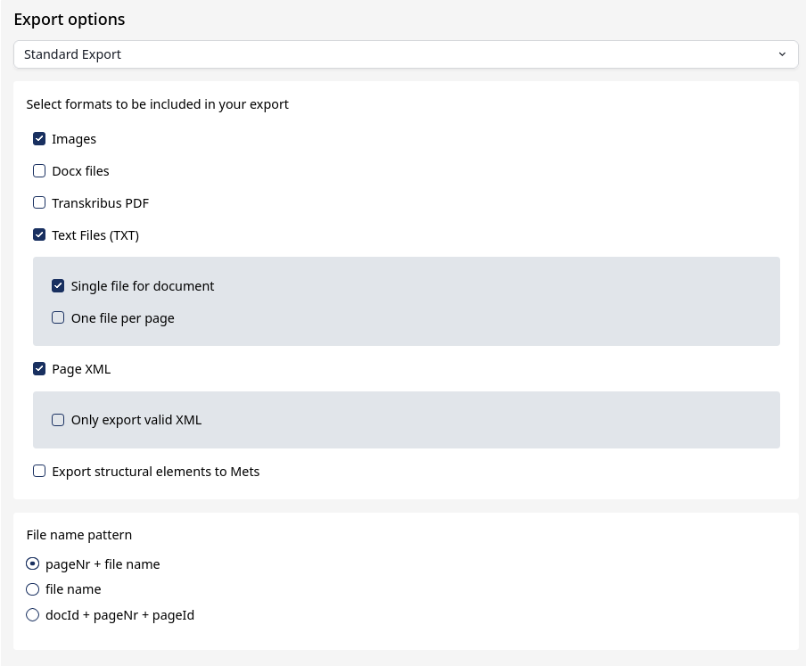

# From Paper To Pixel: Experimental Framework for Access to Historical Spanish Documents

[](https://www.python.org/downloads/)
[](https://pytorch.org/)
[](https://docs.ultralytics.com/)
[](LICENSE)

A flexible experimentation framework for testing OCR and document layout models on historical documents, handling all phases—from exporting and preparing data, to model training, inference, evaluation, and visualization—and designed to be reusable with any corpus exported from Transkribus.

## Purpose and Context

This project is designed to support research and experimentation on historical Spanish documents, with the goal of improving access to their content through OCR and document layout analysis. Historical documents pose specific challenges for automatic processing due to handwriting variability, page degradation, and complex layouts, which makes systematic experimentation and evaluation essential.

The framework operates on data exported from Transkribus and relies on the PAGE XML format, a widely used standard for representing document structure, textual content, and layout annotations. In this context, *layout information* refers to the spatial and structural description of documents, including text and non-text regions, their bounding boxes (page coordinates), and reading order.

The processed data and experimental pipeline are model-agnostic and can be used to train and evaluate both OCR models (such as Tesseract, TrOCR, or Granite) and document layout or document understanding models (such as YOLO-based approaches). By providing a unified and reproducible workflow, the project facilitates comparison across models and encourages reuse of both the data and the experimental setup in other research contexts.

## Table of Contents
1. [Project Overview](#project-overview)
2. [Hardware and Software](#hardware-and-software-used)
3. [Stage 1: Data Preparation](#stage-1-data-preparation)
4. [Stage 2: Fine-tuning Models](#stage-2-fine-tuning-the-models)
5. [Stage 3: Evaluation](#stage-3-evaluation)
6. [Stage 4: Evaluation Analysis](#stage-4-evaluation-analysis)
7. [Stage 5: Analyze Best and Worst Predictions](#stage-5-analyze-best-and-worst-predictions)


## Project Overview

This project provides a complete pipeline for document OCR and layout analysis. It allows users to:

1. **Prepare datasets** exported from Transkribus.
2. **Fine-tune different OCR and layout models** (Tesseract, Granite, trOCR, DocLayout) on custom corpora.
3. **Evaluate model performance** across multiple metrics.
4. **Analyze the best and worst predictions** to understand model behavior and identify errors.

The full workflow is divided into multiple stages:

* **Stage 1:** Data preparation — organizes raw data, parses XML, and splits datasets.
* **Stage 2:** Model fine-tuning — prepares model-specific datasets and trains OCR/layout models.
* **Stage 3:** Evaluation — runs automatic evaluation scripts to compute metrics and track performance.
* **Stage 4:** Evaluation analysis — visualizes results to compare models.
* **Stage 5:** Best and worst predictions analysis — inspects extreme cases to understand errors and edge cases.

---

## Hardware and Software Used

### Hardware Requirements

The experiments for this project were run in the following environment. Compatibility with other configurations has not been tested.
* **CPU:** 12 physical cores (24 logical cores)
* **GPU:** NVIDIA RTX PRO 5000 Blackwell
  * GPU count: 1
  * CUDA cores: 14 080
  * Total GPU memory: 51.31 GB
  * Architecture: Blackwell
* **RAM:** 64 GB

### Software Requirements

* **Operating system:** Linux (kernel 6.17.8, Fedora 42, glibc 2.41)
* **CUDA version:** 13.0
* **Python version:** 3.12.12
* **Python dependencies:** listed in [`requirements.txt`](requirements.txt).

### Virtual Environment Set Up
1. Create the environment with python 3.12.12 (make sure to have it installed in the system).
```
python3.12 -m venv env
source env/bin/activate
pip install --upgrade pip
```
2. Install the dependencies, except PyTorch.
```
pip install -r requirements.txt
```
3. Install PyTorch according to your GPU and CUDA from the [official website](https://pytorch.org/get-started/locally/):

```
pip install torch torchvision --index-url https://download.pytorch.org/whl/cuXXX

pip3 install torch torchvision --index-url https://download.pytorch.org/whl/cu130
```

### Tesseract Set Up
Tesseract is not installed with _pip_. The Tesseract package has to be installed in the system, and then, set the models' directory.

**Fedora/Linux:**
```
# Install Tesseract + Spanish language pack + dev tools
sudo dnf install tesseract tesseract-langpack-spa tesseract-devel

# Set TESSDATA_PREFIX permanently
echo 'export TESSDATA_PREFIX=./tesseract/models/' >> ~/.bashrc
source ~/.bashrc

cp -r /usr/share/tesseract/tessdata/configs/ tesseract/models

```

**Ubuntu/Debian:**
```
# Install Tesseract + Spanish language pack + dev tools
sudo apt update
sudo apt install tesseract-ocr tesseract-ocr-spa libleptonica-dev

# Set TESSDATA_PREFIX permanently
echo 'export TESSDATA_PREFIX=./tesseract/models/' >> ~/.bashrc
source ~/.bashrc
```

**Windows (PowerShell):**
1. Install Tesseract OCR
: Download the Windows installer from [Tesseract at UB Mannheim](https://github.com/UB-Mannheim/tesseract/wiki) and install it.  Make sure to select **Add to PATH** during installation.

2. Set TESSDATA_PREFIX 
: In PowerShell (relative path from the project root):

```
# Set TESSDATA_PREFIX permanently for the session
setx TESSDATA_PREFIX ".\tesseract\models\"
```
---
Or permanently (so you don’t have to run it every time):
- Press `Win + S` → **Environment Variables** → Edit system environment variables → Environment Variables…
  - Under **User variables**, click **New**:
    - Variable name: `TESSDATA_PREFIX`
    - Variable value: `tesseract\models\`
    - Click **OK**.
  
3. Copy _configs_ in the models folder
: 

-  Locate Tesseract installation folder. Usually: `C:\Program Files\Tesseract-OCR\tessdata\configs`.

-  Copy the `configs` folder inside `tesseract\models`.

## STAGE 1: Data Preparation
**Usage** The full data preparation pipeline is handled by a single script: [prepare_data.py](prepare_data.py). To run it, these steps are required:

1. Download the data from Transkribus using these settings:

After downloading the .zip file, save it in the folder `data`. Then, unzip it in `data/<CORPUS_NAME>/raw_data`, where `<CORPUS_NAME>` is the corpus' name that the user chooses. To do that, run this command line from the source root:
``` 
unzip data/<ZIP_FILE_NAME>.zip -d data/<CORPUS_NAME>/raw_data
```
2. Run the full pipeline from the terminal:

```
cd data
python prepare_data.py --corpus <CORPUS_NAME>
```

This _Data Preparation_ Stage consists of three main steps. With this command line, all three steps (raw data organization, XML parsing, dataset splitting) will run automatically.

### Step 1: Raw Data Organization

What it does:
- Flattens nested folders from Transkribus exports (page folders)
- Moves JPG scans, XML files, and TXT transcriptions into proper ground_truth_data/ subfolders
- Converts JPG images to TIFF format for archival or processing needs
- Cleans unwanted log files, duplicate folders (like - Copy) and removes empty or zero-byte images

Resulting folder structure:

```
data/
├── data_utils # data preparation python module
├── prepare_data.py # Python script pipeline
└── <CORPUS_NAME>/
    ├── raw_data/ # Original exported data
    └── ground_truth_data/
        ├── tiff/ # TIFF images generated from JPG
        ├── jpg/ # Original JPG images
        ├── txt/ # Transcriptions
        └── xml/ # PAGE XML files
```

### Step 2: XML Parsing
- Reads XML files from `ground_truth_data/xml/`
- Extracts regions, lines, and relations
- Computes normalized YOLO bounding boxes for regions
- Generates Tesseract `.box` files for lines
- Produces full JSON structured data for downstream tasks
- Maps region types to class IDs using `class_mapper.py`


Resulting folder structure:
```
data/
├── data_utils # data preparation python module
├── prepare_data.py # Python script pipeline
└── <CORPUS_NAME>/
    ├── raw_data/ # Original exported data
    └── ground_truth_data/
        ├── tiff/ # TIFF images generated from JPG
        ├── jpg/ # Original JPG images
        ├── txt/ # Transcriptions
        ├── xml/ # PAGE XML files
        ├── yolo_labels/ # YOLO normalized region bounding boxes
        ├── box_lines/ # Absolute line boxes
        └── json/  # Structured JSON data
```

### Step 3: Dataset Splitting
- Generates train/validation/test splits (default: 80/10/10)
- Copies relevant files for each split into dedicated folders: `train/`, `val/`, `test/`. Each split contains: `images/`, `tiff/`, `txt/`, `xml/`, `box_lines/`, `yolo_labels/`.
- Saves `splits.json` file to store split information and for reproducibility

Resulting folder structure:

```
data/
├── data_utils # data preparation python module
├── prepare_data.py # Python script pipeline
└── <CORPUS_NAME>/
    ├── raw_data/ # Original exported data
    ├── ground_truth_data/
    ├── train/
    │   ├── images/
    │   ├── tiff/
    │   ├── txt/
    │   ├── xml/
    │   ├── box_lines/
    │   └── yolo_labels/
    ├── val/
    │   └── ... same structure as train
    └── test/
        └── ... same structure as train
```

---
## STAGE 2: Fine-tuning the Models
In this stage, the prepared dataset is used to fine-tune the OCR/Document Understanding models. Each model has its own folder inside the project root:

```
docLayout/
granite/
tesseract/
trOCR/
```

Inside each folder, there are three scripts:

- `prepare_dataset.py`: prepares the dataset specifically for that model.
- `finetune.py`: fine-tunes the model on your dataset.
- `inference.py`: runs inference (predictions) using the fine-tuned model.

For all the models, the pipeline is the same:
### **1. Prepare the Dataset**
Before fine-tuning any model, the dataset must be prepared for that specific model. For that, run the `prepare_dataset.py` script for the chosen model, specifying the name of your corpus. This organizes images and ground truth text into the structure expected by the model.

**Usage**
The script has to be executed from the source root. To run it correctly, run this command line:
```
python MODEL_TYPE/prepare_dataset.py --corpus YOUR_CORPUS_NAME
```
where `<MODEL_TYPE>` is the type of model (tesseract, granite, trOCR or docLayout), and `<CORPUS_NAME>` the name of the corpus used.

### **2. Fine-tuning**
To fine-tune the models, the process is similar. To run the `finetune.py` scripts, the command line is nearly the same:
```
python MODEL_TYPE/finetune.py --corpus YOUR_CORPUS_NAME --input_model <BASE_MODEL> --output_model <FINETUNED_MODEL>
```
where: 
- `<MODEL_TYPE>` is the type of model (tesseract, granite, trOCR or docLayout)
- `<CORPUS_NAME>` is the name of the corpus used
- `<BASE_MODEL>` refers to the name of the model that is going to  be fine-tuned with the corpus `<CORPUS_NAME>`
- `<FINETUNED_MODEL>` is the name of the new model

**IMPORTANT:** All the input models must be in `<MODEL_TYPE/models>` subfolders, and the new ones will be saved there.
### **Notes on Base Models for Fine-tuning**

When running the fine-tuning scripts for each model, there are some important points to consider regarding the base/pretrained models:
- **tesseract**: The base models must be downloaded from the [official Tesseract repository](https://github.com/tesseract-ocr/tessdata) and placed in `tesseract/models/`. 
To use these models, set the `--input_model` argument as the name of the model, without the extension. For example, in the case of [spa.traineddata](https://github.com/tesseract-ocr/tessdata/blob/main/spa.traineddata), set `input_model` spa.
- **docLayout**: The base model must be downloaded manually ([link](https://huggingface.co/juliozhao/DocLayout-YOLO-DocStructBench/resolve/main/doclayout_yolo_docstructbench_imgsz1024.pt)) and placed in the subfolder `docLayout/models` before running `finetune.py`. If the `<BASE_MODEL>` is this, there is no need to specify it with the argument, since it will be its default value.
- **granite**: If no `--input_model` is specified, the script will use the default:
`ibm-granite/granite-vision-3.2-2b`
- **trOCR**: If no `--input_model` is specified, the script will use the default: `microsoft/trocr-base-handwritten`

| Model Type  | Default Base Model                                                                                                                            | Notes                                                                          |
|------------|-----------------------------------------------------------------------------------------------------------------------------------------------|--------------------------------------------------------------------------------|
| **Tesseract** | User must [download](https://github.com/tesseract-ocr/tessdata) (e.g., `spa.traineddata`)                                                     | Use name without extension in `--input_model`                                  |
| **docLayout** | User must [download](https://huggingface.co/juliozhao/DocLayout-YOLO-DocStructBench/resolve/main/doclayout_yolo_docstructbench_imgsz1024.pt)  | Must be downloaded and saved in `docLayout/models` manually before fine-tuning |
| **Granite** | `ibm-granite/granite-vision-3.2-2b`                                                                                                           | Default used if `--input_model` not specified                                  |
| **trOCR** | `microsoft/trocr-base-handwritten`                                                                                                            | Default used if `--input_model` not specified                                  |

---

## STAGE 3: Evaluation

After fine-tuning the models, they can be evaluated on the prepared datasets using the automated evaluation scripts provided. The project includes a script [`predict_and_evaluate.sh`](predict_and_evaluate.sh) hat allows interactive evaluation: you can select the corpus, the model families, and the models to evaluate on all splits (`train`, `val`, `test`). 

**Usage:**
Run from the project root:
```
bash predict_and_evaluate.sh
```
How it works:

- **Corpus and Splits**:You select the corpus to evaluate. All splits (`train`, `val`, `test`) are evaluated automatically.
- **Models**: The script lists available model families (Granite, TrOCR, Tesseract, DocLayout) and the models in each family. Users can select which families to evaluate, and then the script iterates over the relevant models.
- **Evaluation function**: Internally, the script calls [`evaluation.run_evaluation`](evaluation/run_evaluation.py), which:
  1. Runs the `predict_on_dataset` function of each model to generate predictions for the selected split. 
  2. Computes evaluation metrics:
     - OCR models (Granite, TrOCR, Tesseract): CER, WER, Levenshtein distance, NED, BLEU, ROUGE1, ROUGEL. 
     - Layout model (DocLayout): Average IoU, F1 per class, composite score, and Exact Match Rate (EMR) per page
  3. Tracks energy consumption and carbon emissions using codecarbon and saves them in JSON.
- **Output**: For each model and split:
  * Predictions and emissions (`.json` and `.csv` files) are saved in `<model_type>/predictions/<model_name>/<corpus>/<split>/`.
  * Metrics are saved in `<model_type>/evaluation/<corpus>/<split>/metrics-<model_name>.json`.
- **Flexibility:** Users can easily customize the evaluation interactively:
  * **Corpus:** Choose which corpus to evaluate.
  * **Models:** Select which model families to evaluate (Granite, TrOCR, Tesseract, DocLayout).
  * **Evaluation options:** Decide whether to compute evaluation metrics or only generate predictions.
This setup ensures all models are evaluated consistently and results are stored in a structured, reproducible way.

---
## STAGE 4: Evaluation Analysis

After running model evaluations, you can analyze and visualize the results using the provided plotting script. This allows you to quickly compare OCR and layout model performance across different metrics.

### **Folder structure**
The evaluation metrics are saved in a structured way during the [`run_evaluation`](evaluation/run_evaluation.py) stage:
```
<MODEL_TYPE>/evaluation/<CORPUS>/<SPLIT>/metrics-<MODEL_NAME>.json
```
Each JSON file contains all computed metrics for the corresponding model, corpus, and dataset split.


### **Visualization Script**

A Python script [`plot_metrics.py`](plot_metrics.py) is provided to plot all evaluation metrics from these JSON files.

**Features:**

- Automatically loads all models found in a specified folder.
- Plots metrics such as CER, WER, BLEU, ROUGE, IoU, F1, EMR, etc., depending on the model type.
- Allows filtering out specific models from the plot.
- Supports custom titles for the plots.
- Displays results in a grid layout for easy comparison.

---

### **Usage**

1. Plot metrics from a single split:
```
python plot_metrics.py --base_path <MODEL_TYPE>/evaluation/<CORPUS>/<SPLIT>
````

2. Exclude specific models:

```
python plot_metrics.py --base_path <MODEL_TYPE>/evaluation/<CORPUS>/<SPLIT> --exclude <MODEL_NAME>
```

3. Customize the title of the plot:

```
python plot_metrics.py --base_path <MODEL_TYPE>/evaluation/<CORPUS>/<SPLIT> --title "<MODEL_TYPE> <SPLIT> Metrics"
```

### **Tips**

* Set `--base_path` to the folder containing the evaluation JSON files for the models you want to compare.
* The script automatically detects the available metrics from the JSON files.
* You can generate plots for multiple model types and splits to observe trends and compare performance.


Here’s a complete **README section in Markdown** for your “Best and Worst Instances Analysis” script. It explains usage, paths, and how it ties into your evaluation pipeline.

---

## STAGE 5: Analyze Best and Worst Predictions

After evaluating your models, it’s often useful to inspect the **best and worst predictions** to understand model behavior and error patterns. This project includes a script to automatically generate this analysis.

### Script

The script [`worst_best_analysis.py`](worst_best_analysis.py) generates:

1. **Figures** for each model showing the top `n` best and worst pages.
2. A **JSON file** summarizing the results for all models.


### How it Works

1. For each model type (`tesseract`, `granite`, `trOCR`, `docLayout`) the script loads the evaluation JSON files from:

```
<BASE_DIR>/<MODEL_TYPE>/evaluation/<SPLIT>/metrics-<MODEL_NAME>.json
```

2. Each JSON contains per-page metrics (`cer` for OCR models, `iou` for layout models).

3. The script sorts pages by the metric:

   * **CER (Character Error Rate)** → ascending (lower is better)
   * **IoU (Intersection over Union)** → descending (higher is better)

4. It selects the top `n` best and worst pages and generates **image plots** with page IDs and metric values.

5. Saves a consolidated JSON:

```
images/worst_best/worst_best.json
```

---

### Usage

```bash
python worst_best_analysis.py  --base_dir . --corpus <CORPUS_NAME> --split test  --top_n 3
```

**Arguments:**

| Argument     | Description                                                                  |
|--------------| ---------------------------------------------------------------------------- |
| `--base_dir` | Root folder containing model evaluations. Default: `.`                       |
| `--corpus`   | Dataset folder name.
| `--split`    | Dataset split to analyze: `train`, `val`, or `test`. Default: `test`         |
| `--top_n`    | Number of best/worst pages to display per model. Default: `3`                |

---

### Output

1. **Figures**:

```
images/worst_best/<model_type>_<model_name>_best.png
images/worst_best/<model_type>_<model_name>_worst.png
```

2. **JSON summary**:

```
images/worst_best/worst_best.json
```

Example structure:

```json
{
  "granite": {
    "baseline": {
      "best": [{"page_id": "0001", "cer": 0.02, "path": "data/<CORPUS_NAME>/test/images/0001.jpg"}],
      "worst": [{"page_id": "0023", "cer": 0.45, "path": "data/<CORPUS_NAME>/test/images/0023.jpg"}]
    }
  },
  "docLayout": {
    "los101": {
      "best": [{"page_id": "0056", "iou": 0.95, "path": "data/<CORPUS_NAME>/test/images/0056.jpg"}],
      "worst": [{"page_id": "0078", "iou": 0.40, "path": "data/<CORPUS_NAME>/test/images/0078.jpg"}]
    }
  }
}
```

---

### Notes

* The script **automatically detects all models** with evaluation JSONs in the split folder.
* It **assumes images are stored** in:

```
data/<CORPUS_NAME>/<split>/images/
```

* Users can modify `top_n` to inspect more or fewer pages.

* Useful for quickly spotting **systematic errors** and **edge cases** in OCR or layout models.


## Contact / Support

For questions, issues, or suggestions regarding this project, you can reach out to:

- **GitHub:** [jaionemacicior](https://github.com/jaionemacicior)
- **Email:** jaione.macicior@unavarra.es

## Related Publications and Data

- **Preprint:** [Transcribing Spanish Texts from the Past: Experiments with Transkribus, Tesseract and Granite (arXiv)](https://arxiv.org/abs/2507.04878)  
- **Corpus:** [Los101 (Zenodo)](https://zenodo.org/records/17902212). 

> Note: The corpus has been used in the experiments described in the preprint, but it is **not required** to run this framework. The environment can be used with any corpus exported from Transkribus.

